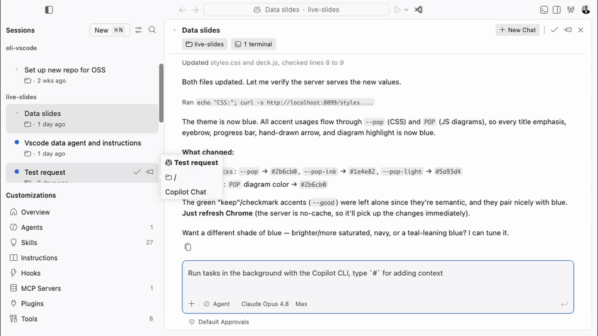

# Agents window: make the browser preview *auditable* — keep changed files + agent chat visible alongside the preview

> **Status: DRAFT for review.** Research complete (2 UserTesting studies + telemetry), spike implemented and committed in Code OSS, and the demo below was captured from a real build. Nothing here is posted publicly yet.

## Executive summary

We ran two moderated UserTesting studies on the **Agents window browser preview** — variant **A "decoupled"** and variant **B "preview"** — with 10 professional engineers (5 per variant, all code daily and use AI coding tools). The clearest, most consistent signal across both variants and confirmed by product telemetry:

**When developers preview an agent's UI change, they need to verify it against *what the agent actually changed* — the file diff — and keep instructing the agent, all in the same view. Today the preview forces them to tab away to see file changes, which breaks the loop.**

The recommended change is a focused Agents-window layout improvement: **when a browser preview is open in a session, keep the Changes (diff) panel and the active agent chat visible alongside it**, and (fast-follow) let users **click an element in the preview to jump to the file/diff that renders it.** This is a change in the **Agents window** (`src/vs/sessions/**`), not the editor-window browser.

### 🎥 Demo — the new UI (real Code OSS build, not a mockup)

*Captured from a locally built Agents window (this branch) editing `live-slides`: the agent chat (left), the live browser preview (center), and the Changes/diff panel (right) are all visible at once — no tab-switching to see what the agent changed. Full-res: `new-ui-demo.mp4`.*

---

## Why this matters (findings)

All quotes are verbatim from participants (P##). Telemetry is VS Code Stable desktop; see caveats at the end.

### 1. Verify visual output against the agent's file changes, in the same flow — *strongest signal*
Nine of ten participants ranked **"list of file changes in this branch" in their top two** things to keep visible during preview. They repeatedly could not tell what the agent had touched:

- P159: *"I can't see any of the files that have been changed so far. So I can't tell if the agentic tools are modifying files that it shouldn't be."*
- P81: *"What feels missing is the file changes panel. I can't see diffs or know which files were modified without switching tabs."*

**Telemetry backs the underlying behavior:** ~**7.6M** Stable-desktop users explicitly create side-by-side editor splits in a 6-week window (~13% of the ~57M base), and ~**597k** open a file diff + ~**451k** open the Source Control changes view by command (keyboard/palette only, so a floor). People go out of their way to see two things at once; the preview should not take that away.

### 2. Keep the active agent chat visible — it's the control loop
The active session chat drew the most first-place "keep visible" votes. It's how people iterate on the UI:

- P80: *"immediately ask the agent to adjust that specific part rather than restarting the whole process."*
- P81: *"I can see the agent's chat on the left and the live preview on the right."* (praising side-by-side)

**Telemetry:** preview users and agent users are the same population — ~**20%** of weekly preview users also send chat requests and ~**14%** run agent-mode (tool) sessions in the same week; **6.4%** of preview sessions already contain a chat request. A preview-beside-chat layout serves a real, overlapping audience.

### 3. Bridge from preview element → source file/diff (fast-follow)
Participants wanted to go from a pixel to the code that owns it:

- P80: *"I could directly click on the element in the preview [and] immediately see the exact file, component, or line of code responsible for it."*
- P58: *"Branch changes right here… that's where I would go."*

No telemetry exists for this (it doesn't ship yet), but `git.openChange` (~597k users/6wk) shows the adjacent demand to jump from a change to its code.

### 4. Preview should be embedded/split and resizable
Both variants liked side-by-side context but complained when the preview was too small or not where expected:

- P14: *"preview should not be going in that small section."*
- P35: *"I wouldn't expect a full page redirect, just a split-screen live preview."*

**Telemetry:** the native Simple Browser is negligible (~165 DAU), while the **Live Preview** extension has ~**541k** users / ~149k WAU / ~239k fresh installs in 6 weeks — strong demand for an *embedded* in-editor preview that the built-in surface isn't meeting.

### 5. Make preview lifecycle states explicit (confusion)
Several participants misread the prototype's server-start/refresh activity as a failure:

- P104: *"I'm not clear why it's restarting the server and all this stuff, did it go wrong?"*
- P58: *"It looks like whoever's doing this is having issues."*

Qualitative only (no lifecycle telemetry). Cheap to fix with clear states: starting → ready → refreshing → failed, and whether refresh is automatic.

---

## A vs B decision

At n=5 per variant this is directional, not statistical, but the direction is consistent:

- **Embedded (B) matched expectations better.** Participants expected a split/embedded preview in the same workspace, not a separate/decoupled surface. B drew fewer "where did it go / is it broken" reactions.
- **"Decoupled" (A) produced more confusion** about state and surrounding UI, and produced **no** strong desire for separation. The strongest desires in *both* were: see the diff, keep chat, resize, and link preview→source.
- **Decision:** pursue the **embedded, same-workspace preview** direction (B), and invest the design effort in *auditability* (diff + chat visible, click-to-source) rather than in a detached browser.

---

## Proposed change (where it gets built)

Scope: **Agents window only** (`src/vs/sessions/**`). Not the editor-window `browserView`.

- **Layout:** when a session has a browser preview open, keep the **Changes** view and the **agent chat** visible alongside it, instead of the diff being hidden behind the preview. Orchestrated in `src/vs/sessions/contrib/layout/browser/desktopSessionLayoutController.ts` (the observable rule set that governs the auxiliary-bar / Changes visibility), reusing the existing Changes view (`src/vs/sessions/contrib/changes/browser/changesView.ts`, container `workbench.view.agentSessions.changesContainer`).
- **Preview surface:** the Agents-window browser preview (integrated `browserView`), opened via `IBrowserViewWorkbenchService`.
- **Fast-follow (finding #3):** "inspect element in preview → reveal changed file/diff" using the changes view's existing file-open path (`IEditorService`).
- **Cheap win (finding #5):** explicit preview lifecycle status in the preview toolbar.

**Demo:** captured from a real launched Code OSS build (Agents window, this branch) — see `new-ui-demo.gif`. The spike compiles (`typecheck-client`) and passes `valid-layers-check`.

### Implementation status (spike)

- **Done:** `[D-preview]` layout rule added to `desktopSessionLayoutController.ts` — when the Agents-window browser preview (`BrowserEditorInput`) becomes the active editor in a created session, it reveals the Changes view alongside, respecting an explicit per-session hide (mirrors the existing `[D8]` auto-reveal guard). Compiles + layer-clean; verified loaded in a real build.
- **Note:** the reveal intentionally does **not** override a session where the user previously hid the side panel (same guard as `[D8]`). Whether the preview context should *always* pull Changes into view (a stronger reveal) is an open design question worth deciding before merge.
- **Fast-follow:** preview→source linking (finding #3) and explicit lifecycle status (finding #5) are not yet implemented.

---

## Method & caveats

- **Studies:** "vscode Agents - Browser Preview A (decoupled)" and "B (preview)", 5 completed sessions each, think-out-loud, screen+audio. Participants all screened as engineers who code daily and use AI tools.
- **Small sample:** 10 total; findings are directional. Transcripts include speech-to-text artifacts.
- **Telemetry:** VS Code Stable desktop; raw events retained ~45 days so adoption metrics use a 42-day window and heavy joins use 7 days. `workbenchactionexecuted` only fires for keyboard/palette actions, so context-switch and diff-open counts are **lower bounds** (mouse clicks on tabs/files aren't instrumented). No telemetry exists for the prototype itself; quant is adjacent shipping behavior.

_Raw transcripts, per-participant audience data, the full analysis, and the telemetry queries are archived in the research project folder._
